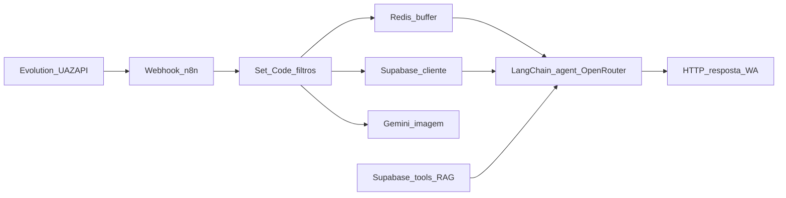

# N8N — Mapa

## Fluxos ativos

| Fluxo | Gatilho | O que faz | Status |
|-------|---------|-----------|--------|
| Atendimento WhatsApp (mensagens) | Webhook HTTP (payload Evolution / UAZAPI) | Normaliza mensagem → Redis (buffer) → Supabase (cliente) → ramo texto vs imagem → agente LangChain (`agente_refeicao`) com ferramentas Supabase / RAG → HTTP resposta WhatsApp | Ativo (export em `workflow-export.json`) |
| Webhook auxiliar | Segundo webhook no mesmo workflow | Ex.: eventos ou modos (`cadastro_feito`, macros) — rever nós ligados no editor n8n | Ativo |

## Diagrama (visão lógica)

## Export do workflow

- Ficheiro sanitizado (referência técnica): [`workflow-export.json`](./workflow-export.json)  
- Contém nós, ligações e metadados do n8n; **não** incluir de novo chaves API ou `pinData` ao reexportar — usar credenciais nativas do n8n.

## Diagrama de automações (texto)

1. **Entrada**: webhooks recebem JSON (cabeçalhos `uazapiGO-Webhook/1.0` no tráfego real típico) com `BaseUrl` da API, `instanceName`, `token` da instância, `message` / `chat`.
2. **Normalização**: nó `camposIniciais` e outros `Set` mapeiam meta (`telefoneCliente`, `nomeCliente`, etc.); `Code in JavaScript` ignora mensagens `wasSentByApi` / `fromMe`.
3. **Buffer**: Redis agrega mensagens por `telefone` + esperas (`Wait`) para processar em lote.
4. **Cliente**: Supabase (`getClient`, …) credencial **Alimentaai**.
5. **Multimodal**: ficheiro / imagem → `Convert to File` → **Google Gemini** (`Analyze image1`); texto → agente com **OpenRouter** (`OpenRouter Chat Model`, modelo `google/gemini-2.5-flash`).
6. **Agente**: `agente_refeicao` com memória Postgres (`Postgres Chat Memory`, `Chat Memory Manager`) e ferramentas (`registrar_refeicao` na tabela `refeicoes`, vector store Supabase, embeddings).
7. **Saída**: `Responde texto` e outros `HTTP Request` para API de envio (Evolution / UAZAPI).
