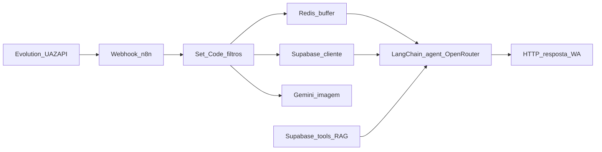

# N8N — Mapa

## Repositório de exports (GitHub)

- **Repo**: [Alimentaai-git/alimentaai-n8n](https://github.com/Alimentaai-git/alimentaai-n8n) — um ficheiro JSON por workflow exportado (naming típico `{workflowId}-{slug}.json`).
- **No mono-repo local** (pasta irmã do Brain): `alimentaai-n8n/`.

## Fluxos ativos (espelhados nos exports)

| Fluxo (nome no n8n) | ID | Gatilho | O que faz | Ficheiro no repo `alimentaai-n8n` |
|---------------------|-----|---------|-----------|-----------------------------------|
| **ALIMENTAAI - NOVO** | `jUpFRGibl0PhTje4O9hGW` | Webhooks HTTP: entrada WhatsApp (**Evolution / UAZAPI**, nós `Webhook` / `Webhook1`); entrada **site** (`recebe_do_site`) | `camposIniciais` → `Code in JavaScript` (filtro `fromMe` / `wasSentByApi`) → Redis (`Redis`, `Puxar as Mensagens`, `Wait`) → Supabase `getClient` / `getSubscribe` → ramo por tipo de mensagem (`mensagem_tipo`) → texto (`edit` + buffer) ou imagem (`Convert to File2` → `Analyze image1` Gemini) → `Switch` por estado (cadastrado / trial / expirado) com nós `prompt_*` → agente LangChain **`agente_refeicao`** (OpenRouter `google/gemini-2.5-flash`, memória Postgres, tools `registrar_refeicao`, `consultar_*`, `buscar_alimento_taco`, `marcar_tbf_concluido`, etc.) → **`Responde texto4`** / `Responde texto` / `HTTP Request` para UAZAPI. Inclui ramos **TBF** (`tbf_interactions`, `gera_link_trial`, `envia_boas_vindas`) e utilitários (`apaga_nutriAI`, `backup`). | `jUpFRGibl0PhTje4O9hGW-alimentaai---novo.json` |
| **REMARKETING - POS CTA** | `Jo_uHGT1AvFCUY1P79RLe` | **Cron** (dois ramos no canvas) + **Webhook** `Webhook Redirect` (tracking de clique → `Marcar Clique` → `Respond to Webhook`) | Postgres: **Buscar Leads** / **Buscar Leads1** → `Loop` / `Loop1` → `Switch` por step → envio WhatsApp via **`HTTP Request`** (`Enviar Step 1` … `Enviar Step 5`) → **Update** em Postgres após cada envio. | `Jo_uHGT1AvFCUY1P79RLe-REMARKETING---POS-CTA-undefined.json` |
| **REMARKETING - TBF** | `ebLaJoyyXXEUimyOLxxY9` | **Cron** | Mesmo padrão: Postgres **Buscar Leads** → `Loop` → `Switch1` → steps com **HTTP Request** + **Update** Postgres. | `ebLaJoyyXXEUimyOLxxY9-REMARKETING---TBF-undefined.json` |

Estado **ativo** no último export analisado: os três workflows acima vêm com `"active": true` no JSON.

## Referência cruzada (Brain vs repo n8n)

| O quê | Onde |
|--------|------|
| Documentação e diagrama lógico | Este ficheiro (`03-n8n/MAPA.md`) |
| Export sanitizado **com parâmetros** úteis para rever prompts, assignments e tools (sem `pinData` / segredos) | `alimentaai-brain/03-n8n/workflow-export.json` |
| Exports “por workflow” tal como saem do n8n (útil para IDs, nomes de nós e topologia; neste snapshot muitos nós trazem `parameters: {}` vazio — horários de Cron e SQL completos vivem no editor / credenciais) | Repo **`alimentaai-n8n`** (ficheiros listados na tabela) |

## Diagrama (visão lógica)

## Export do workflow (ficheiros)

- Ver secção **Referência cruzada** acima: `workflow-export.json` no Brain + JSONs no repo **`alimentaai-n8n`**.
- **Não** voltar a commitar `pinData`, chaves `sk-*` nem tokens de instância UAZAPI em texto claro — usar credenciais nativas do n8n.

## Diagrama de automações (texto)

1. **Entrada (ALIMENTAAI - NOVO)**: webhooks recebem JSON (cabeçalhos `uazapiGO-Webhook/1.0` no tráfego real típico) com `BaseUrl` da API, `instanceName`, `token` da instância, `message` / `chat`; o nó **`recebe_do_site`** liga automação a eventos vindos do **site** (detalhe de contrato no código do site / Edge Functions).
2. **Normalização**: nó `camposIniciais` e outros `Set` mapeiam meta (`telefoneCliente`, `nomeCliente`, etc.); `Code in JavaScript` ignora mensagens `wasSentByApi` / `fromMe`.
3. **Buffer**: Redis agrega mensagens por `telefone` + esperas (`Wait`) para processar em lote.
4. **Cliente**: Supabase (`getClient`, …) credencial **Alimentaai**.
5. **Multimodal**: ficheiro / imagem → `Convert to File` → **Google Gemini** (`Analyze image1`); texto → agente com **OpenRouter** (`OpenRouter Chat Model`, modelo `google/gemini-2.5-flash`).
6. **Agente**: `agente_refeicao` com memória Postgres (`Postgres Chat Memory`, `Chat Memory Manager`) e ferramentas (`registrar_refeicao` na tabela `refeicoes`, vector store Supabase, embeddings).
7. **Saída**: `Responde texto4` / `Responde texto` e `HTTP Request` para API de envio (Evolution / UAZAPI).

8. **Remarketing (workflows separados)**: crons disparam leitura de leads em **Postgres** (nós `postgres` dedicados — credencial própria no n8n); mensagens saem por **HTTP Request** para a API de WhatsApp; updates em Postgres marcam progressão do funil. **POS CTA** inclui ainda **Webhook Redirect** + `Respond to Webhook` para registo de clique antes do redirect.
