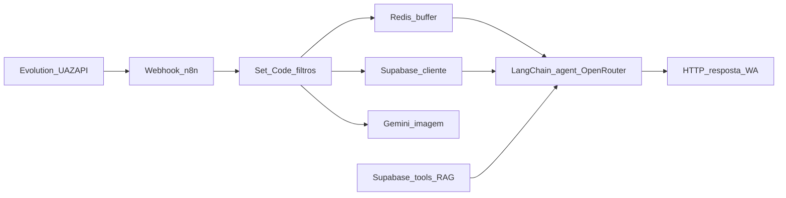

# AlimentaAI — Contexto Completo

> Gerado automaticamente em 2026-04-17 23:59 UTC
> **Não edite este arquivo diretamente.** Edite os arquivos fonte nas pastas 00-12.


---
## 00-identidade/MAPA.md

# Identidade — Mapa

## O que é o AlimentaAI

Serviço de **nutrição e hábito alimentar assistidos por IA**, com foco no **WhatsApp** como canal principal de conversa e ajuste de plano, complementado por **painel web** para metas e histórico. Interpreta **refeições a partir de fotos** e texto para aproximar a pessoa do seu objetivo (emagrecimento, ganho de massa ou alimentação mais saudável) com menos fricção que apps tradicionais de dieta.

## Missão

Tornar **comer melhor** acessível e sustentável: menos burocracia, mais **acompanhamento contínuo** no lugar onde a pessoa já está (WhatsApp), com tecnologia que **adapta o plano à vida real**.

## Visão

Ser a referência no Brasil em **acompanhamento nutricional por conversa + IA** — reconhecido por resultados percebidos, retenção por confiança (não por culpa) e experiência que **respeita o imprevisto** do dia a dia.

## Valores

| Valor | Na prática |
|-------|------------|
| **Simplicidade** | Menos passos entre “o que comi” e “o que fazer a seguir”. |
| **Humanidade** | Tom acolhedor; falhas do dia viram ajuste, não abandono. |
| **Transparência** | Preço e cancelamento claros; sem promessas vazias. |
| **Segurança e respeito** | Dados e privacidade tratados com cuidado; linguagem responsável sobre corpo e saúde. |

## Posicionamento

**“Nutricionista no bolso” via WhatsApp** — preço acessível (landing: *menos de R$ 1 por dia* como âncora quando válido comercialmente), **100% no WhatsApp** para o núcleo da jornada, **teste grátis sem cartão** onde oferecido, **sem fidelidade** onde comunicado. Diferencial frente a apps: **tempo real**, **menos cliques**, **conversa** em vez de só formulários frios.

## História

Produto em evolução no ecossistema AlimentaAI (site/app, automações, marketing). Marco estrutural: criação do **segundo cérebro** (`alimentaai-brain`) para centralizar contexto e decisões e alimentar LLMs e integrações com a mesma **fonte da verdade**.


---
## 00-identidade/CONTEXTO.md

# Identidade — Contexto

## Público-alvo principal

Pessoas que querem **emagrecer, ganhar massa ou comer melhor** sem se perder em apps complexos ou em consultas presenciais caras. Valorizam **conversar no WhatsApp**, ter plano **ajustado em tempo real** e acompanhar evolução (incluindo **fotos de refeição** que viram interpretação de macros e calorias no fluxo do produto). Perfil Brasil: linguagem **pt-BR**, tom próximo e incentivo à consistência sem culpa.

## Dores que resolvemos

- **Fricção dos apps de dieta**: abrir app várias vezes ao dia, buscar alimentos em listas enormes, ajustar gramas manualmente e gastar muitos minutos só para registrar uma refeição.
- **Planos rígidos que não cabem na vida real**: imprevistos (jantar fora, família, evento) derrubam o plano; falta alguém que **reorganize o dia** sem “começar do zero”.
- **Custo e acesso**: nutrição de qualidade parece inacessível; o AlimentaAI posiciona acompanhamento contínuo **no canal que a pessoa já usa** (WhatsApp), com **teste sem cartão** e **sem fidelidade** onde o produto assim o comunica.

## Proposta de valor

**Nutrição guiada por IA no WhatsApp** — plano personalizado que **se adapta ao que aconteceu** (incluindo ajustes após “exagerou” ou mudou o dia), mais **registro e leitura de refeições** (foto do prato → interpretação do que comeu) e **painel** para metas e histórico, conforme o ecossistema do produto.

Em uma linha (alinhada à landing): *Seu nutricionista no WhatsApp, com plano ajustado em tempo real — sem app extra, sem consulta cara e sem complicação.*

## Tom de voz

- **Brasileiro, direto e acolhedor** — “beleza”, “sem culpa”, “é assim que funciona de verdade”, celebração de pequenas vitórias.
- **Claro sobre limites** — se não houver dado no contexto (produto, política, saúde), dizer honestamente; não inventar orientação clínica individual.
- **Motivador sem ser grosseiro** — empurra consistência, não vergonha; erros do dia viram **ajuste**, não julgamento eterno.
- **Evitar** — tom corporativo frio, jargão médico excessivo sem necessidade, promessas milagrosas (“em X dias garantido”).

## O que NÃO somos

- **Não somos substituto de médico ou nutricionista presencial** para casos que exijam avaliação clínica presencial, exames ou patologias específicas — somos ferramenta de hábito e acompanhamento no modelo do produto.
- **Não somos app de contagem genérico** que obriga microgerenciar cada grama no silêncio; o diferencial é **conversa + IA + WhatsApp** (e painel quando aplicável).
- **Não somos conteúdo de choque ou restrição extrema** — evitamos linguagem que normalize transtorno alimentar ou culpa pesada.


---
## 01-produto/MAPA.md

# Produto — Mapa

## Visão geral do produto

Acompanhamento de nutrição/hábito alimentar com **IA no WhatsApp** (conversa, ajustes de plano) e **painel web** para metas e histórico; registro simplificado incluindo **foto da refeição** interpretada como macros/calorias no discurso do produto. Planos pagos com **Stripe**; identidade e auth com **Supabase**.

## Funcionalidades ativas

| Feature | Status | Descrição |
|---------|--------|-----------|
| Landing e marketing | Ativo no código | `/` — hero, demos, FAQ, CTAs |
| Auth (login/registo) | Ativo no código | `/auth` |
| Onboarding “Comece agora” | Ativo no código | `/comece-agora` |
| Dashboard | Ativo no código | `/dashboard` |
| Planos | Ativo no código | `/planos` |
| Assinatura Stripe | Ativo no código | `/assinar`, `/assinatura` + `checkout/sucesso` |
| Onboarding pós-compra | Ativo no código | `/onboarding/revisao`, `/onboarding/ativar-teste` |
| Documentos legais | Ativo no código | privacidade e termos |
| Analytics | Ativo no código (se env configurado) | Meta Pixel + GA4, eventos de checkout/subscribe |
| Teste WhatsApp | Ativo no código | CTA abre WhatsApp (`VITE_WHATSAPP_NUMBER` no `.env`) |

## Funcionalidades planejadas

| Feature | Prioridade | ETA |
|---------|------------|-----|
| A definir pela equipa | — | Documentar em `10-roadmap/` quando houver decisão |

## Fluxo principal do utilizador

1. **Descoberta** → `/`
2. **Interesse** → teste WhatsApp ou `/comece-agora` ou `/planos`
3. **Conta** → `/auth` quando necessário
4. **Compra** → `/assinar` → Stripe → `/checkout/sucesso`
5. **Uso** → `/dashboard` + interação WhatsApp (fora deste repo front)


---
## 01-produto/CONTEXTO.md

# Produto — Contexto

## Estado atual

- Produto entregue como **SPA** no repositório [site-alimentaai](https://github.com/Alimentaai-git/site-alimentaai) com fluxos de landing, auth, onboarding, dashboard e pagamentos descritos em `01-produto/MAPA.md` e `02-site/MAPA.md`.
- Catálogo de preços e IDs para checkout/analytics centralizados em `planCatalog` (ver `01-produto/precos/`).

## Principais decisões tomadas

- **Checkout Stripe** com sessão criada no cliente via helper dedicado; redirecionamento completo para Stripe.
- **Lead antes do pagamento**: sem `ref` UUID válido, o utilizador preenche nome e WhatsApp e o sistema chama a Edge Function `assinar-lead` para obter `refId` antes do Stripe.
- **Tracking**: eventos alinhados ao `PLAN_CATALOG` para Meta e GA4 no momento de checkout/subscrição.

## Limitações conhecidas

- Comportamento completo dos fluxos WhatsApp e automações **não** está neste repositório front — documentar em `03-n8n/` quando o fluxo estiver descrito noutro sítio.
- Dependência de variáveis `VITE_*` e de projeto Supabase/Stripe corretamente configurados em cada ambiente.

## Feedback dos utilizadores

- **A recolher** — quando houver tickets, NPS ou exportações, resumir aqui ou em `06-clientes/CONTEXTO.md`.

## Próximas evoluções

- **A documentar** em `10-roadmap/` com datas dono — não inferir a partir só do código.


---
## 01-produto/precos/CONTEXTO.md

# Preços — Contexto

## Estratégia de precificação

- **Âncora**: trimestral com badge de escolha majoritária e custo-diário baixo vs. percepção de “nutricionista”.
- **Entrada**: mensal com barreira mais baixa e ênfase em cancelamento simples.
- **Upsell / retenção longa**: anual com “maior economia” e benefícios cumulativos listados na página de assinatura.

Tudo acima reflete o **posicionamento implementado no site**, não um benchmark externo anexado.

## Benchmarks do mercado

- **Não preenchidos a partir do repositório do site** — adicionar quando houver pesquisa de concorrentes ou dados internos.

## Decisões tomadas

- Preços e IDs de conteúdo para analytics/checkout vivem centralmente em `src/lib/planCatalog.ts` (valores atuais: 27,9 / 75,9 / 229,9 BRL).
- Eventos Meta (`InitiateCheckout`) e GA4 (`begin_checkout`) usam `contentId` / valor do mesmo catálogo para consistência com Stripe.


---
## 02-site/MAPA.md

# Site — Mapa

## Estrutura de páginas

| Página | Rota | Objetivo |
|--------|------|----------|
| Landing (home) | `/` | Apresentar proposta de valor, demos WhatsApp, FAQ, CTAs para teste e assinatura |
| Autenticação | `/auth` | Login/registo; reforço de benefício (foto → macros, WhatsApp + painel) |
| Comece agora | `/comece-agora` | Onboarding inicial do lead (dados para começar) |
| Dashboard | `/dashboard` | Área logada — acompanhamento, gráficos, histórico |
| Planos | `/planos` | Página de planos (catálogo de oferta) |
| Assinar | `/assinar`, `/assinatura` | Escolha de ciclo (mensal/trimestral/anual), captura lead se necessário, checkout Stripe |
| Checkout sucesso | `/checkout/sucesso` | Pós-pagamento Stripe |
| Onboarding revisão | `/onboarding/revisao` | Passo pós-compra |
| Ativar teste | `/onboarding/ativar-teste` | Fluxo de ativação de teste |
| Política de privacidade | `/politica-de-privacidade` | Legal |
| Termos de uso | `/termos-de-uso` | Legal |
| 404 | `*` | Página não encontrada |

Fonte de rotas: repositório do site (`App.tsx` / router).

## Funil de conversão

1. **Topo**: visitante chega à `/` (orgânico, paid, indicação — canal a documentar em marketing).
2. **Meio**: interação com CTAs “Testar grátis” / WhatsApp e leitura de prova social na landing.
3. **Fundo**: `/assinar` (ou `/planos` → assinatura) com Stripe; parâmetros opcionais `?src=` (campanha) e `?ref=` (UUID de utilizador/lead já criado).
4. **Pós-compra**: `/checkout/sucesso` e rotas `/onboarding/*` conforme implementação.

Fluxo alternativo: `/comece-agora` → recolha de dados → continuação para auth/dashboard conforme produto.

## Integrações ativas no site

| Integração | Como entra | Notas |
|------------|------------|--------|
| Meta Pixel | `VITE_META_PIXEL_ID` no `.env`; carregamento em `initAnalytics()` | Eventos ex.: `InitiateCheckout` com `content_ids` do plano |
| Google Analytics 4 | `VITE_GA4_MEASUREMENT_ID` no `.env` | Eventos ex.: `begin_checkout`, subscrição alinhada ao catálogo |
| Supabase | Cliente JS + Edge Functions (ex.: `assinar-lead`) | URL e keys via variáveis de ambiente |
| Stripe | Checkout hospedado (`startStripeCheckout`) | Redirecionamento para pagamento; retorno com query `checkout=canceled` tratada em `/assinar` |

Não documentar valores secretos de API no Brain — apenas nomes de variáveis e comportamento.

## Automação WhatsApp (fora do código do site)

O atendimento por WhatsApp (Evolution / UAZAPI → n8n → Supabase / LLM) está documentado na pasta **`03-n8n/`**.  
Export sanitizado do workflow (JSON): [`workflow-export.json`](../03-n8n/workflow-export.json) — **sem** `pinData`, chaves `sk-*` nem tokens de instância; credenciais devem existir só no n8n.


---
## 02-site/CONTEXTO.md

# Site — Contexto

## Objetivo principal do site

**Converter** visitantes em utilizadores: teste de WhatsApp sem fricção, clareza de preço (“menos de R$ 1 por dia” como âncora na hero quando o cálculo do trimestral o permite) e **assinatura** via Stripe. O site também suporta **autenticação** e **painel** para quem já é cliente.

## Estado atual

- Landing em `/` com hero focado em **nutrição no WhatsApp**, plano ajustado em tempo real, **sem app extra** e **sem consulta cara** (copy alinhada ao componente `Index`).
- Destaques de confiança na navegação: **100% no WhatsApp**, **cancele quando quiser**, **teste grátis sem cartão** onde aplicável.
- Checkout e planos vivem em `/assinar` (alias `/assinatura`), com planos mensal, trimestral e anual definidos no código (`PLAN_CATALOG`).
- Fluxo de checkout cancelado: query `?checkout=canceled` mostra toast e limpa o parâmetro da URL.

## Decisões de design e UX tomadas

- **Mobile-first** e demos estilo conversa WhatsApp na home para reduzir abstração do produto.
- **Gradientes** e cores em torno de verde/teal (tokens HSL — ver `05-marketing` e `00-identidade/STACK`).
- **Shadcn/Radix** para componentes acessíveis (accordion, dialog, toast).
- **Proxy Vite** em desenvolvimento para chamadas ao mesmo origin em relação ao Supabase (evitar erros de CORS no dev).

## Principais métricas

- **Ainda não documentadas neste repositório** — preencher quando houver GA4/Meta exportados ou dashboard interno (CTR, conversão por página, CAC).


---
## 03-n8n/MAPA.md

# N8N — Mapa

## Fluxos ativos

| Fluxo | Gatilho | O que faz | Status |
|-------|---------|-----------|--------|
| Atendimento WhatsApp (mensagens) | Webhook HTTP (payload Evolution / UAZAPI) | Normaliza mensagem → Redis (buffer) → Supabase (cliente) → ramo texto vs imagem → agente LangChain (`agente_refeicao`) com ferramentas Supabase / RAG → HTTP resposta WhatsApp | Ativo (export em `workflow-export.json`) |
| Webhook auxiliar | Segundo webhook no mesmo workflow | Ex.: eventos ou modos (`cadastro_feito`, macros) — rever nós ligados no editor n8n | Ativo |

## Diagrama (visão lógica)



## Export do workflow

- Ficheiro sanitizado (referência técnica): [`workflow-export.json`](./workflow-export.json)  
- Contém nós, ligações e metadados do n8n; **não** incluir de novo chaves API ou `pinData` ao reexportar — usar credenciais nativas do n8n.

## Diagrama de automações (texto)

1. **Entrada**: webhooks recebem JSON (cabeçalhos `uazapiGO-Webhook/1.0` no tráfego real típico) com `BaseUrl` da API, `instanceName`, `token` da instância, `message` / `chat`.
2. **Normalização**: nó `camposIniciais` e outros `Set` mapeiam meta (`telefoneCliente`, `nomeCliente`, etc.); `Code in JavaScript` ignora mensagens `wasSentByApi` / `fromMe`.
3. **Buffer**: Redis agrega mensagens por `telefone` + esperas (`Wait`) para processar em lote.
4. **Cliente**: Supabase (`getClient`, …) credencial **Alimentaai**.
5. **Multimodal**: ficheiro / imagem → `Convert to File` → **Google Gemini** (`Analyze image1`); texto → agente com **OpenRouter** (`OpenRouter Chat Model`, modelo `google/gemini-2.5-flash`).
6. **Agente**: `agente_refeicao` com memória Postgres (`Postgres Chat Memory`, `Chat Memory Manager`) e ferramentas (`registrar_refeicao` na tabela `refeicoes`, vector store Supabase, embeddings).
7. **Saída**: `Responde texto` e outros `HTTP Request` para API de envio (Evolution / UAZAPI).


---
## 03-n8n/CONTEXTO.md

# N8N — Contexto

## Por que n8n

Orquestração visual de **WhatsApp (Evolution / UAZAPI)** com **Redis** (debounce / fila curta), **Supabase** (dados e vector store), **vários LLMs** (Gemini para imagem, OpenRouter para chat do agente, OpenAI para embeddings no RAG) e **Postgres** para memória de conversa — num único fluxo versionável.

## Fluxos mais críticos

- **Webhook principal de mensagens**: se falhar, o cliente não recebe resposta automática.
- **Agente `agente_refeicao` + ferramentas Supabase** (ex.: persistência em `refeicoes`): núcleo do produto “macros por refeição”.
- **Redis** na agregação de mensagens: se Redis estiver indisponível ou com TTL errado, mensagens podem fragmentar-se ou atrasar-se.

## Pontos de atenção

- **Credenciais**: nunca embutir `sk-` ou tokens de instância no JSON exportado — usar **Credentials** do n8n e reexportar sem segredos (como em `workflow-export.json`).
- **Custos**: cada mensagem pode acionar Gemini, OpenRouter e embeddings; monitorizar quotas.
- **Dependências externas**: Supabase, Redis, host UAZAPI (`BaseUrl` típico `https://alimentaai.uazapi.com` no payload), e instância Evolution devem estar saudáveis em cadeia.
- **Manutenção**: nós placeholder (`Replace Me`, `No Operation`) devem ser tratados ou removidos no editor.

## Como buscar contexto do Brain no n8n

```
Nó: HTTP Request
Método: GET  
URL: https://raw.githubusercontent.com/Alimentaai-git/alimentaai-brain/main/99-contexto-llm/contexto-completo.md
```

Injete o resultado como system prompt em qualquer nó LLM do fluxo.

## Segurança (lembrete)

Se um export antigo continha **chaves ou PII**, rodar as chaves no fornecedor e **não** voltar a commitar `pinData` nem API keys em nós `Set`.


---
## 04-infraestrutura/MAPA.md

# Infraestrutura — Mapa

## Arquitetura geral

| Componente | Função | Notas |
|--------------|--------|--------|
| **Site (SPA)** | Landing, auth, dashboard, checkout | Vite/React — ver `02-site/STACK.md`; hosting público a documentar quando fixo |
| **Supabase** | Postgres, Auth, Edge Functions, Storage (conforme projeto) | Usado pelo site e pelo n8n |
| **Stripe** | Pagamentos | Checkout a partir do site |
| **n8n** | Orquestração WhatsApp + LLM | Self-hosted; padrão de deploy observado: **Easypanel** (`*.easypanel.host` para webhooks) |
| **Redis** | Buffer de mensagens no fluxo n8n | Credencial “Redis account” no n8n |
| **Evolution / UAZAPI** | Camada WhatsApp | Ex.: `BaseUrl` `https://alimentaai.uazapi.com` no payload típico (domínio de produto, não segredo) |
| **LLM externos** | OpenRouter, Google Gemini, OpenAI | Chamados a partir do n8n |

Diagrama lógico alinhado a `03-n8n/MAPA.md` e `08-integracoes/MAPA.md`.

## Ambientes

| Ambiente | URL | Uso |
|----------|-----|-----|
| Produção | *A preencher* (domínio do site + projeto Supabase) | Tráfego real |
| Staging | *Opcional* | Testes |
| Dev | `localhost` (site); n8n pode usar execução manual / webhooks de teste | Desenvolvimento |

## Git e repositórios

Proteção da `main` do site, branch `dev`, repos `alimentaai-n8n` / `alimentaai-marketing` e convenção de commits: [**REPOS-E-FLUXO-GIT.md**](REPOS-E-FLUXO-GIT.md).


---
## 04-infraestrutura/CONTEXTO.md

# Infraestrutura — Contexto

## Decisões de arquitetura

- **Supabase** como backend único para dados e funções serverless consumidas pelo site e referenciadas no n8n.
- **n8n self-hosted** (Easypanel) para colar **WhatsApp ↔ Redis ↔ LLM ↔ Supabase** sem deployar lógica pesada no site estático.
- **Redis** dedicado ao debounce / fila curta de mensagens no fluxo WhatsApp (não substitui o Postgres do Supabase).

## Custos mensais

| Serviço | Custo | Renovação |
|---------|-------|-----------|
| Supabase | *A preencher* | |
| Stripe | % + fixo conforme faturação | |
| n8n / Easypanel / VPS | *A preencher* | |
| Redis | *A preencher* | |
| UAZAPI / Evolution | *A preencher* | |
| OpenRouter + Gemini + OpenAI | *A preencher* (uso variável) | |

## Pontos de atenção

- **Segurança**: exports do n8n não devem conter `pinData` com PII nem chaves `sk-*` — ver incidente corrigido com `03-n8n/workflow-export.json` sanitizado.
- **Disponibilidade**: webhook n8n é **ponto único** de entrada da automação WhatsApp; monitorizar uptime e TLS.
- **Rotação de segredos**: qualquer chave que tenha estado em Git público deve ser **rotacionada** no fornecedor.


---
## 05-marketing/MAPA.md

# Marketing — Mapa

## Canais ativos

| Canal | Objetivo | Frequência | Responsável |
|-------|----------|------------|-------------|
| Site (landing) | Conversão e teste | Contínua | *A definir dono* |
| Meta Ads (Pixel) | Remarketing / conversões | Quando `VITE_META_PIXEL_ID` configurado | *A definir* |
| Google Analytics 4 | Medição de funil | Quando `VITE_GA4_MEASUREMENT_ID` configurado | *A definir* |
| WhatsApp (CTA) | Teste e suporte comercial | Contínua | *A definir* |

## Funil de marketing

- **Topo**: tráfego para `/` (orgânico, paid, indicação — detalhar em campanhas).
- **Meio**: prova social e demos de conversa; secção “Por que você sempre desiste?” contrastando apps tradicionais vs. AlimentaAI.
- **Fundo**: `/assinar` com planos e Stripe; parâmetros `?src=` e `?ref=` para atribuição e checkout com utilizador já referenciado.

## Calendário editorial

- *Fora do repositório do site — ligar Notion/planilha aqui quando existir.*


---
## 05-marketing/CONTEXTO.md

# Marketing — Contexto

## Estratégia atual

- **Mensagem principal (hero)**: “Seu nutricionista no WhatsApp” com âncora de preço acessível (“por menos de R$ 1 por dia” quando o cálculo do plano trimestral o suporta).
- **Subpromessa**: emagrecer, ganhar massa ou comer melhor com plano **ajustado em tempo real**, sem app extra nem consulta cara.
- **Prova na página de planos**: badges de copy (“Escolhido por 73% dos usuários”, “Maior economia”) — tratar como **mensagem de marketing** no site, não como estatística auditada neste documento.
- **Canais técnicos**: Meta Pixel e GA4 opcionais via `VITE_META_PIXEL_ID` e `VITE_GA4_MEASUREMENT_ID` (ver `02-site/MAPA.md`).

## O que já testamos e não funcionou

- *A preencher com dados reais de campanha / retrospectivas.*

## O que está funcionando

- *A preencher com métricas por canal (CPL, ROAS, etc.) quando disponíveis.*

## Identidade visual — diretrizes principais

- Marca **AlimentaAI** com wordmark “Alimenta” em gradiente + “AI” em cor de texto.
- Uso consistente de **verde/teal** (HSL) para primário e secundário; fundo claro com ruído suave na hero.
- CTAs em **pill** com gradiente primary→secondary; ícone de presente no “Testar grátis”.
- Tom visual: moderno, saúde/digital, sem exagero “clínico frio”.

## Paleta de cores

Valores em **HSL** (componentes `h s l` sem `hsl()` — o Tailwind do site usa `hsl(var(--token))`).

| Token | HSL `:root` | Uso |
|-------|-------------|-----|
| `--background` | `0 0% 100%` | Fundo geral (tema claro) |
| `--foreground` | `160 84% 8%` | Texto principal |
| `--primary` | `160 84% 39%` | Marca, CTAs, ênfase |
| `--primary-foreground` | `0 0% 100%` | Texto sobre primário |
| `--secondary` | `160 61% 65%` | Gradientes, apoio visual |
| `--secondary-foreground` | `160 84% 8%` | Texto sobre secundário |
| `--muted` | `160 30% 96%` | Fundos suaves |
| `--muted-foreground` | `160 10% 45%` | Texto secundário |
| `--accent` | `160 100% 45%` | Destaques |
| `--accent-foreground` | `0 0% 100%` | Texto sobre accent |
| `--destructive` | `0 84.2% 60.2%` | Erros / aviso |
| `--border` / `--input` / `--ring` | `160 30% 90%` / idem / `160 84% 39%` | Limites e foco |

Tema **`.dark`**: ver mesmo ficheiro no site para valores noturnos.

## Tipografia

| Fonte | Peso | Uso |
|-------|------|-----|
| Inter | 300–900 (Google Fonts no `index.html` do site) | Títulos e corpo |


---
## 05-marketing/STACK.md

# Marketing — Stack

## Ferramentas
| Ferramenta | Uso |
|---|---|
| | |

## Repositório de assets
<!-- Onde ficam as artes, templates, fotos oficiais -->

## Acesso às contas de mídia
<!-- Onde ficam documentados os acessos (não as senhas) -->


---
## 06-clientes/MAPA.md

# Clientes — Mapa

## Personas

### Persona 1 — “Exausta de apps de dieta”

- **Perfil**: Adulto que já tentou vários apps de contagem de calorias; usa smartphone no dia a dia; quer resultado sem microgestão.
- **Dor principal**: Abrir app várias vezes ao dia; procurar alimentos em listas longas; ajustar gramas à mão; gastar vários minutos só para registar um almoço simples.
- **Como nos encontrou**: Orgânico ou anúncio (a confirmar em dados) — landing `/`.
- **O que mais valoriza**: **100% no WhatsApp**, plano que **se adapta** quando o dia foge ao planeado, linguagem sem culpa excessiva.
- **Maior objeção de compra**: “Será mais um serviço que abandono?” — resposta na copy: teste grátis sem cartão onde comunicado, cancelamento simples.

### Persona 2 — “Vida real imprevisível”

- **Perfil**: Pessoa com eventos sociais, família, viagens; precisa de flexibilidade, não de plano rígido que “estraga” com um jantar fora.
- **Dor principal**: Culpa e sensação de “recomeçar do zero” após escorregar; falta de acompanhamento humano/IA que **reorganize o dia**.
- **Como nos encontrou**: Indicação ou redes (a confirmar).
- **O que mais valoriza**: Ajustes em **tempo real**; mensagens estilo “sem problema, amanhã equilibramos” alinhadas à demo da landing.
- **Maior objeção de compra**: Preço vs. nutricionista presencial — contrapor com **custo por dia** baixo e conveniência.

## Segmentos de clientes

| Segmento | Tamanho estimado | Característica principal |
|----------|------------------|---------------------------|
| Perda de peso | *A medir* | Foco em déficit e consistência |
| Ganho de massa / performance | *A medir* | Foco em proteína e calorias |
| Reeducação alimentar geral | *A medir* | Foco em hábito e simplicidade |


---
## 06-clientes/CONTEXTO.md

# Clientes — Contexto

## Feedbacks recorrentes

### Elogios mais comuns

- *A consolidar a partir de suporte, NPS ou reviews — não inferido do código.*

### Reclamações mais comuns

- *Idem.*

## Casos de uso reais

- **Uso desejado pelo produto**: enviar refeições e mensagens pelo **WhatsApp**; acompanhar metas e histórico no **painel** web; percorrer **onboarding** após compra ou teste.
- **Cenários ilustrados na landing**: planeamento do dia; imprevisto à noite; resposta acolhedora e reajuste — ver demos na página inicial do site.

## Churn — por que saem

- *A documentar com dados de billing e inquéritos de cancelamento.*

## Depoimentos e provas sociais

- A landing pode conter provas sociais dinâmicas ou estáticas — **sincronizar** aqui os links ou IDs de conteúdo quando a equipa fixar a fonte oficial (não duplicar dados pessoais sem consentimento).

## Alinhamento com identidade

- Dores e promessas deste ficheiro devem manter-se **coerentes** com `00-identidade/CONTEXTO.md` (WhatsApp, simplicidade, sem culpa, não somos substituto clínico).


---
## 07-metricas/MAPA.md

# Métricas — Mapa

## North Star Metric
> **[Defina aqui a métrica principal que define sucesso do AlimentaAI]**

## Métricas por área
| Área | Métrica | Meta | Atual | Tendência |
|---|---|---|---|---|
| Produto | | | | |
| Site | Conversão | | | |
| Marketing | CAC | | | |
| Financeiro | MRR | | | |
| Operacional | | | | |

## Atualizado em
<!-- Data da última atualização das métricas -->


---
## 07-metricas/CONTEXTO.md

# Métricas — Contexto

## Como medimos
<!-- Quais ferramentas de analytics e BI usamos -->

## Cadência de revisão
<!-- Com que frequência olhamos para os números -->

## Histórico de performance
<!-- Evolução das métricas principais ao longo do tempo -->

## Insights gerados pelos dados
<!-- O que aprendemos e o que mudamos por causa disso -->


---
## 08-integracoes/MAPA.md

# Integrações — Mapa

## Diagrama do ecossistema

```
[Visitante] ──► [Site SPA] ──► [Stripe] + [Supabase Edge]
                    │
                    └──► [Meta / GA4]

[WhatsApp] ◄──► [Evolution / UAZAPI] ──webhook──► [n8n]
                                              │
                    ┌─────────────────────────┼─────────────────────────┐
                    ▼                         ▼                         ▼
              [Redis buffer]            [Supabase DB + Vector]     [OpenRouter / Gemini / OpenAI]
                    │                         │
                    └────────► [LLM Agent] ◄───┘
                                    │
                                    └──► [HTTP] ──► [Evolution / UAZAPI] ──► [WhatsApp]

[BRAIN] ◄──── contexto para LLM (raw GitHub URL) ◄── usado pelo n8n e outros
```

## Mapa de integrações

| De | Para | O que passa | Como | Crítico? |
|----|------|-------------|------|----------|
| Site | Supabase | Auth, dados, `assinar-lead` | HTTPS + anon key | Sim |
| Site | Stripe | Checkout de plano | Redirect sessão | Sim |
| Site | Meta / GA4 | Eventos de funil | Browser + `VITE_*` | Não |
| Evolution / UAZAPI | n8n | Payload mensagem / instância | Webhook POST JSON | Sim |
| n8n | Redis | Mensagens agregadas por chave | Redis protocol | Sim |
| n8n | Supabase | Queries, tools, vector store | REST / API Supabase | Sim |
| n8n | OpenRouter / Google / OpenAI | Prompts, imagem, embeddings | HTTPS API | Sim |
| n8n | Evolution / UAZAPI | Envio de texto / mídia | HTTP Request | Sim |
| n8n | Brain (GitHub raw) | `contexto-completo.md` | GET HTTP | Recomendado para qualidade das respostas |

## APIs externas

| API | Uso | Quem chama | Documentação |
|-----|-----|------------|----------------|
| Supabase | DB, Auth, Edge Functions, Storage (conforme projeto) | Site, n8n | docs.supabase.com |
| Stripe | Pagamentos | Site | stripe.com/docs |
| UAZAPI / Evolution | WhatsApp Business API layer | n8n | Documentação do fornecedor UAZAPI |
| OpenRouter | Chat completions | n8n (LangChain) | openrouter.ai |
| Google Gemini | Visão / imagem | n8n | Google AI |
| OpenAI | Embeddings | n8n | platform.openai.com |


---
## 08-integracoes/CONTEXTO.md

# Integrações — Contexto

## Fluxo principal ponta a ponta (site → pagamento)

Fluxo documentado a partir da página **`/assinar`** no site [site-alimentaai](https://github.com/Alimentaai-git/site-alimentaai):

1. **Entrada**: utilizador abre `/assinar` ou `/assinatura`. Query opcional `?src=` (campanha) e `?ref=` (UUID de utilizador/lead já existente).
2. **Validação de `ref`**: se `ref` for um UUID válido, o checkout pode prosseguir **sem** o mini-formulário de nome/WhatsApp.
3. **Criação de lead** (quando não há `ref` válido): utilizador preenche **nome** e **WhatsApp** (normalização para dígitos BR); **POST** à Edge Function Supabase **`assinar-lead`** com header `apikey` (chave publishable) e corpo `telefone` / `user_name`; resposta deve incluir `refId` UUID.
4. **Stripe Checkout**: front chama `startStripeCheckout` com ciclo de faturação (`monthly` | `quarterly` | `yearly`), `refId`/`ref`, `source`, etc.; browser é redirecionado para a URL de sessão Stripe.
5. **Retorno**: sucesso → `/checkout/sucesso`. Cancelamento: Stripe pode devolver com `?checkout=canceled` — o site mostra toast “Pagamento não concluído” e remove o parâmetro da URL.

Passos **fora** deste repositório (WhatsApp bot, n8n, webhooks Stripe no backend) devem ser descritos em `03-n8n/` e na documentação do Supabase quando existirem.

## Mensagens WhatsApp (automação)

Fluxo de alto nível documentado a partir do export em [`03-n8n/workflow-export.json`](../03-n8n/workflow-export.json):

1. **Evolution / UAZAPI** envia **POST** para o webhook do n8n com corpo JSON (`EventType`, `BaseUrl`, `instanceName`, dados de `chat` e `message`, etc.).
2. **Normalização**: nós `Set` / `Code` extraem telefone, texto, tipo de mensagem e ignoram mensagens enviadas pela própria API ou pelo “eu” (`fromMe` / `wasSentByApi`).
3. **Redis**: leitura/escrita de mensagens por telefone e esperas controladas para agrupar burst de texto.
4. **Supabase**: obtenção do registo de cliente (`getClient` e variantes) com credencial de projeto **Alimentaai**.
5. **Ramificação**: mensagem de **imagem** (ou mídia) segue conversão e análise com **Google Gemini**; mensagem de **texto** segue para o agente **LangChain** (`agente_refeicao`) com modelo via **OpenRouter** (`google/gemini-2.5-flash`).
6. **Memória e ferramentas**: Postgres (memória de chat), ferramentas Supabase (ex.: `registrar_refeicao` na tabela `refeicoes`), vector store + embeddings para RAG.
7. **Resposta**: pedidos HTTP de volta à API UAZAPI/Evolution para o utilizador receber mensagem no WhatsApp.

Tokens de instância e chaves de API **não** devem aparecer em repositórios — apenas no n8n **Credentials** e nos serviços de origem.

## Pontos de falha conhecidos

- **`assinar-lead` indisponível ou erro**: checkout não abre; toast genérico no front.
- **`ref` inválido** na URL: mensagem pedindo novo link de pagamento.
- **Stripe / sessão**: falhas de rede ou configuração — utilizador vê “Não foi possível abrir o pagamento”.
- **Variáveis `VITE_*` em falta**: analytics não carrega; WhatsApp de teste pode não abrir (`VITE_WHATSAPP_NUMBER` referenciado no fluxo de teste da app).

## Dependências críticas

| Dependência | Impacto se cair |
|-------------|-----------------|
| Supabase (projeto + Functions) | Auth, dados, `assinar-lead`, URLs Edge |
| Stripe | Impossível cobrar novas assinaturas via fluxo atual |
| Domínio / hosting do site | Utilizadores não chegam ao funil |
| Meta / GA4 | Perda de medição — **não** bloqueia o produto |
| n8n (webhooks) | Automatização WhatsApp para de responder |
| Redis (buffer n8n) | Mensagens podem duplicar-se ou atrasar-se |
| Evolution / UAZAPI | Entrada e saída de WhatsApp indisponíveis |

## Como usar o Brain como contexto em outros sistemas

### No N8N
```
Nó: HTTP Request → GET
URL: https://raw.githubusercontent.com/Alimentaai-git/alimentaai-brain/main/99-contexto-llm/contexto-completo.md
→ Injete como system prompt no nó LLM seguinte
```

### Em qualquer sistema via API
```javascript
const res = await fetch('https://raw.githubusercontent.com/Alimentaai-git/alimentaai-brain/main/99-contexto-llm/contexto-completo.md')
const brain = await res.text()
// use brain como system prompt
```


---
## 09-operacional/MAPA.md

# Operacional — Mapa

## Processos ativos
| Processo | Frequência | Responsável | Documentado em |
|---|---|---|---|
| Update do Brain | A cada decisão | | Este repositório |
| Review de métricas | | | |
| | | | |

## Rituais e cadência
| Ritual | Frequência | Participantes | Objetivo |
|---|---|---|---|
| Review semanal | Semanal | | |
| Planning mensal | Mensal | | |
| | | | |


---
## 09-operacional/CONTEXTO.md

# Operacional — Contexto

## Como o dia a dia funciona
<!-- Rotina operacional do AlimentaAI -->

## Responsabilidades
| Área | Responsável |
|---|---|
| Produto | |
| Tecnologia | |
| Marketing | |
| Clientes | |

## SLAs e compromissos
<!-- Tempos de resposta, uptime prometido, etc. -->

## Quando algo quebra
<!-- Plano de contingência e quem acionar -->


---
## 09-operacional/STACK.md

# Operacional — Stack

## Ferramentas de gestão
| Ferramenta | Uso |
|---|---|
| | |

## Comunicação interna
<!-- Onde a equipe se comunica: Slack, WhatsApp, Discord, etc. -->

## Onde fica o resto da documentação
<!-- Além deste Brain, o que mais existe e onde -->


---
## 10-roadmap/MAPA.md

# Roadmap — Mapa

## Horizonte de tempo

### 🔴 Agora (próximas 4 semanas)
- [ ] 
- [ ] 

### 🟡 Em breve (próximos 3 meses)
- [ ] 
- [ ] 

### 🟢 Futuro (3–12 meses)
- [ ] 
- [ ] 

### 🔵 Visão (12+ meses)
<!-- Onde queremos estar no longo prazo -->

## Atualizado em
<!-- Data da última revisão do roadmap -->


---
## 10-roadmap/CONTEXTO.md

# Roadmap — Contexto

## Como priorizamos
<!-- Critérios: impacto no cliente, receita, esforço técnico? -->

## O que saiu do roadmap e por quê
<!-- Memória de pivôs e abandonos — essencial para não repetir erros -->

## Dependências do roadmap
<!-- O que precisa acontecer antes de outras coisas poderem começar -->

## Hipóteses sendo testadas
<!-- O que estamos apostando que vai funcionar e como vamos validar -->


---
## 11-prompts/CONTEXTO.md

# Prompts — Contexto

## Como versionamos prompts
Qualquer mudança em prompt = commit com mensagem `prompt(id): descrição da mudança`

## Prompts mais críticos
<!-- Os que afetam diretamente a experiência do cliente final -->

## Lições aprendidas
<!-- O que funcionou e o que não funcionou em prompts anteriores -->

## Diretrizes gerais de prompting no AlimentaAI
- Sempre incluir contexto do Brain (via URL raw ou colagem)
- Especificar o modelo alvo no arquivo do prompt
- Documentar a **intenção** do prompt, não só o texto
- Testar com exemplos reais antes de ativar em produção


---
## 12-decisoes/MAPA.md

# Decisões — Mapa

## O que é esta área

Registo **versionado** de decisões relevantes do ecossistema AlimentaAI (produto, técnico, marketing, operacional, financeiro). Cada ficheiro é uma decisão concluída ou em discussão, com contexto explícito para não “perder o porquê” no tempo.

## Fluxo sugerido

1. **Ideia ou tensão** — surge uma dúvida que afeta direção, stack, preço ou processo.
2. **Rascunho** — copiar [`_template.md`](./_template.md), renomear e preencher (pode começar em `Proposta`).
3. **Revisão** — alinhar com quem decide; ajustar alternativas e consequências.
4. **Commit** — ficheiro `YYYY-MM-DD-slug-descritivo.md` na pasta `12-decisoes/`.
5. **Propagação** — quando a decisão muda comportamento real, atualizar o `CONTEXTO.md` (ou `STACK.md`) da área correspondente (`00`–`11`).

## Convenção de nomes

```
YYYY-MM-DD-slug-curto-em-kebab-case.md
```

Exemplo: `2025-04-17-criacao-do-brain.md`

Evitar espaços e caracteres especiais; o slug deve ser legível em URLs e logs.

## Relação com outras pastas

| Quando a decisão impacta… | Atualizar também |
|---------------------------|------------------|
| Posicionamento, tom, missão | `00-identidade/` |
| Features, preços, oferta | `01-produto/`, `01-produto/precos/` |
| Páginas, funil | `02-site/` |
| Fluxos e automações | `03-n8n/` |
| Ambientes, custos, deploy | `04-infraestrutura/` |
| Canais, campanhas | `05-marketing/` |
| Personas, suporte | `06-clientes/` |
| KPIs, medição | `07-metricas/` |
| APIs, sistemas ligados | `08-integracoes/` |
| Processos internos | `09-operacional/` |
| Prioridades temporais | `10-roadmap/` |
| Prompts e modelos | `11-prompts/` |

## Inclusão no contexto LLM

O workflow [`.github/workflows/build-contexto.yml`](../.github/workflows/build-contexto.yml) acrescenta ao `99-contexto-llm/contexto-completo.md` as **últimas 5** decisões (exclui `_template.md`). Manter decisões autocontidas ajuda o modelo a responder sem ambiguidade.


---
## 12-decisoes/CONTEXTO.md

# Decisões — Contexto

## Por que decisões vivem no Git

- **Histórico auditável** — data, autor e evolução ficam explícitos.
- **Mesma fonte que o código e o Brain** — um único fluxo de revisão e branches.
- **Injeção em LLMs** — trechos recentes entram no `contexto-completo.md` gerado pela Action.

## O que entra aqui

- Escolhas com **efeito duradouro** (stack, fornecedor, preço, posicionamento, processo crítico).
- Decisões com **trade-offs** que vale a pena documentar para o futuro.
- **Substituições** de decisões antigas (marcar a anterior como `Substituída` e referenciar a nova).

## O que não entra

- Notas de reunião sem conclusão (use rascunho local ou PR até fechar).
- Detalhe operacional do dia a dia que já cabe em `09-operacional/CONTEXTO.md`.
- Dados pessoais de clientes ou credenciais.

## Estados

Usar o campo **Status** do template: `Proposta`, `Aceita`, `Descartada`, `Substituída`.

- `Proposta` — ainda em discussão; pode coexistir com outras propostas sobre o mesmo tema.
- `Aceita` — passa a ser referência; outras áreas do Brain devem refletir a mudança quando aplicável.

## Revisão periódica

De tempos em tempos, rever decisões `Aceitas` que deixaram de refletir a realidade: criar uma nova decisão que **substitui** a anterior em vez de apagar o ficheiro antigo.


---
## Decisões Recentes

### 12-decisoes/2025-04-17-criacao-do-brain.md
# Criação do Segundo Cérebro no GitHub

**Data**: 2025-04-17  
**Status**: `Aceita`  
**Área**: `Técnico` | `Operacional`  

---

## Contexto
O ecossistema AlimentaAI cresceu com múltiplos repositórios, ferramentas e sistemas
sem um ponto central de contexto e decisões. Conhecimento estava disperso e
inacessível para LLMs e novas ferramentas integradas.

## Problema
- Conhecimento disperso em repositórios separados
- LLMs e ferramentas sem contexto do produto
- Decisões tomadas sem registro → risco de repetir erros
- Difícil onboarding de novos colaboradores ou ferramentas de IA

## Decisão
Criar o repositório `alimentaai-brain` no GitHub como fonte da verdade única,
com estrutura padronizada por área (MAPA + CONTEXTO + STACK) e geração automática
de contexto consolidado para injeção em LLMs.

## Alternativas consideradas
| Alternativa | Por que descartamos |
|---|---|
| Notion | Não versionado, difícil de injetar como contexto via URL |
| Confluence | Pago, overhead de setup, não integra bem com LLMs |
| Google Drive | Sem versionamento semântico, difícil de linkar em sistemas |
| Obsidian | Local, não acessível por outros sistemas |

## Consequências
- Qualquer nova decisão deve ser commitada em `12-decisoes/`
- Mudanças em produto/tech devem atualizar os `.md` da área correspondente
- N8N passa a buscar contexto do Brain antes de chamadas LLM importantes
- GitHub Actions gera `contexto-completo.md` automaticamente a cada commit

## Referências
- Conversa inicial de arquitetura do Brain com Claude (2025-04-17)
